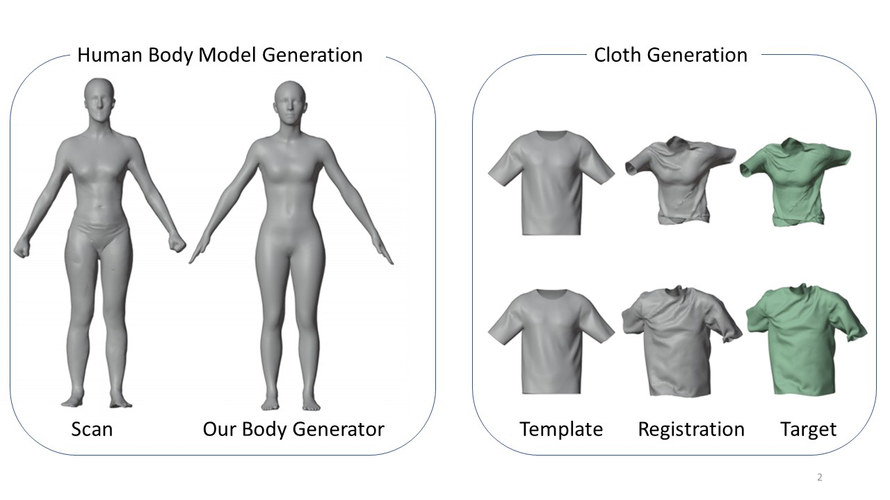

# 1D-Measurement
This work has 2 parts.  
First, we propose a 3D human body generator which users can get their body models by inputting anthropometry  data.   
Second, we design a pipeline to generate 3D cloth data which has same topology, and this data can be treated as cloth simulation training data.  
[Youtube Video](https://www.youtube.com/watch?v=dVLWum9r-3k)  

